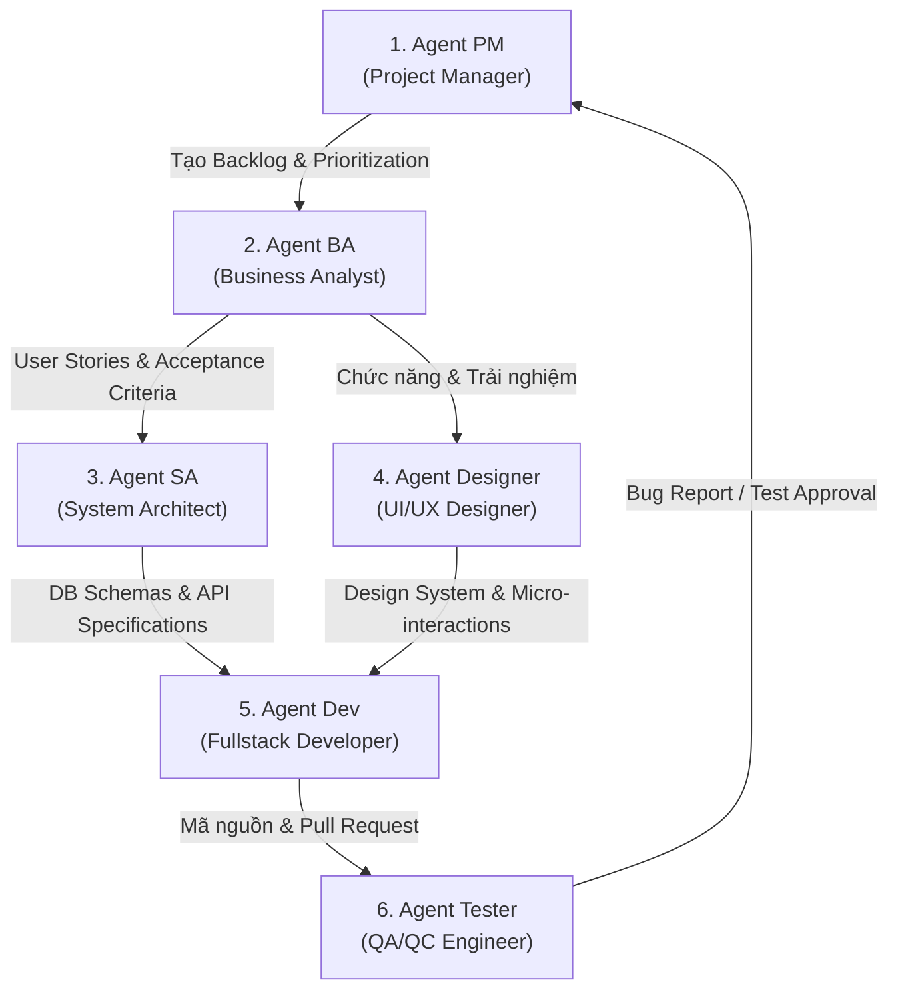

# 🍃 Green Atelier — Hồ Sơ Tài Liệu Dự Án & Quyền Lực 6 Agent Workflow

Tài liệu này lưu trữ toàn bộ thông tin kiến trúc, cấu trúc dự án, tiến độ triển khai website thương mại điện tử **Green Atelier (Matcha Mộc Châu)** và quy trình làm việc phối hợp của hệ thống **6 Agent AI (PM / BA / SA / Designer / Dev / Tester)**.

---

## 📌 1. Tổng Quan Dự Án (Project Overview)

* **Tên dự án**: Green Atelier — Website Thương Mại Điện Tử Matcha Mộc Châu Chế Tác Thủ Công.
* **Tầm nhìn**: Mang lại trải nghiệm mua sắm sang trọng, tinh tế (High-end Aesthetic) kết hợp trắc nghiệm sức khỏe thông minh (Matcha Finder Quiz) và hệ thống quản trị bán hàng toàn diện.
* **Tech Stack chuẩn hóa**:
  * **Frontend**: Next.js (App Router, JavaScript ES6+).
  * **Styling & Design System**: Vanilla CSS Variables, Google Fonts (`Fraunces` & `Manrope`), Responsive Flexbox/Grid.
  * **Database**: MongoDB Atlas kết hợp ODM Mongoose.
  * **Authentication**: JWT Cookie / Auth.js (NextAuth) với phân quyền Role (`customer` & `admin`).
  * **State Management (Giỏ hàng)**: Zustand kết hợp `localStorage` đồng bộ Client-side.
  * **Deployment**: Vercel (Frontend) + MongoDB Atlas (Cloud DB).

---

## 📁 2. Cấu Trúc Thư Mục Dự Án (Directory Architecture)

```
Green-matcha/
├── app/                        # Next.js App Router Routes
│   ├── layout.js               # Root Layout (Inject Global CSS & Font)
│   ├── page.js                 # Trang chủ (Homepage)
│   ├── globals.css             # CSS Variables, Utility Classes & Design Tokens
│   ├── shop/page.js            # Danh sách sản phẩm, Bộ lọc & Sắp xếp
│   ├── product/[id]/page.js    # Chi tiết sản phẩm & Thư viện ảnh
│   ├── cart/page.js            # Giỏ hàng & Tóm tắt chi phí
│   ├── checkout/page.js        # Thanh toán (Form nhận hàng + COD/QR Code)
│   ├── login/page.js           # Đăng nhập Khách hàng
│   ├── register/page.js        # Đăng ký Khách hàng
│   ├── account/page.js         # Quản lý tài khoản (Đơn hàng, Hồ sơ, Địa chỉ)
│   ├── blog/page.js            # Danh sách bài viết kiến thức trà
│   ├── blog/[id]/page.js       # Chi tiết bài viết Blog
│   ├── about/page.js           # Câu chuyện thương hiệu & Giá trị cốt lõi
│   ├── contact/page.js         # Trang liên hệ, Showroom & Bản đồ
│   ├── finder/page.js          # Matcha Finder Quiz
│   └── admin/                  # Cổng Quản trị Admin Portal
│       ├── login/page.js       # Đăng nhập Admin
│       ├── dashboard/page.js   # Dashboard Thống kê Doanh thu & Đơn hàng
│       ├── products/page.js    # Quản lý Sản phẩm (CRUD + Modal)
│       ├── categories/page.js  # Quản lý Danh mục
│       ├── orders/page.js      # Quản lý Đơn hàng & Cập nhật trạng thái
│       ├── customers/page.js   # Quản lý Danh sách Khách hàng
│       └── blogs/page.js       # Quản lý Bài viết Blog
├── components/                 # Reusable Components
│   ├── Header.jsx              # Shared Header
│   ├── Footer.jsx              # Shared Footer
│   ├── ProductCard.jsx         # Card Sản phẩm
│   ├── BlogCard.jsx            # Card Bài viết
│   ├── AdminSidebar.jsx        # Navigation Sidebar Admin
│   └── AdminTopbar.jsx         # Topbar Admin
├── data/
│   └── mockData.js             # Dữ liệu mẫu (Products, Blogs, Orders, Customers)
├── legacy_html/                # Bản lưu trữ các file HTML gốc
└── package.json                # Dependencies & Build Scripts
```

---

## 📊 3. Danh Mục 20 Trang Giao Diện Đã Triển Khai (UI Inventory)

### 🏬 Storefront (13 Trang Khách Hàng)
1. **Homepage (`/`)**: Hero section, 5 nhóm công dụng (Focus, Energy, Calm, Beauty, Immunity), Sản phẩm nổi bật, Quiz CTA Banner, Bài viết mới nhất.
2. **Shop (`/shop`)**: Tìm kiếm tên sản phẩm, bộ lọc checkbox công dụng, lọc khoảng giá, dropdown sắp xếp giá, phân trang.
3. **Product Detail (`/product/[id]`)**: Thư viện ảnh thumbnail, Đánh giá sao, giá bán linh hoạt theo số lượng, danh sách đặc điểm nổi bật, nút Thêm vào giỏ.
4. **Cart (`/cart`)**: Danh sách mặt hàng, bộ điều chỉnh số lượng (+/-), nút xóa sản phẩm, nhập mã giảm giá, tính phí vận chuyển tự động.
5. **Checkout (`/checkout`)**: Thanh tiến trình 3 bước, form điền thông tin người nhận, chọn phương thức COD hoặc Chuyển khoản QR Code VietQR.
6. **Login (`/login`)**: Form đăng nhập email/password, ghi nhớ đăng nhập, banner thương hiệu.
7. **Register (`/register`)**: Form đăng ký thành viên mới, đồng ý điều khoản.
8. **Account (`/account`)**: Tab Đơn hàng của tôi (trạng thái Chờ xác nhận/Đã giao), Tab Thông tin cá nhân, Tab Sổ địa chỉ.
9. **Blog List (`/blog`)**: Danh sách bài viết chia sẻ bí quyết pha chế và lối sống lành mạnh.
10. **Blog Detail (`/blog/[id]`)**: Bài viết chi tiết, trích dẫn nổi bật, tác giả, bài viết liên quan.
11. **About (`/about`)**: Câu chuyện thổ nhưỡng Mộc Châu, quy trình xay cối đá granit thủ công, 4 giá trị cốt lõi.
12. **Contact (`/contact`)**: Thẻ thông tin Showroom, bản đồ vị trí, form gửi phản hồi.
13. **Matcha Finder (`/finder`)**: Trắc nghiệm 1 phút chọn mục tiêu sức khỏe ➔ Hiển thị sản phẩm phù hợp.

### 🛡 Admin Portal (7 Trang Quản Trị)
1. **Admin Login (`/admin/login`)**: Đăng nhập quyền Administrator.
2. **Dashboard (`/admin/dashboard`)**: 4 thẻ chỉ số chính (Doanh thu, Đơn hàng, Khách hàng, Sản phẩm), biểu đồ cột doanh thu & đường đơn hàng.
3. **Products Management (`/admin/products`)**: Bảng quản lý sản phẩm, tìm kiếm, modal Thêm sản phẩm mới, nút Xóa/Sửa.
4. **Categories Management (`/admin/categories`)**: Bảng quản lý danh mục công dụng & số lượng mặt hàng thuộc danh mục.
5. **Orders Management (`/admin/orders`)**: Quản lý tất cả đơn hàng, phân loại status (Chờ xác nhận, Đã xác nhận, Đang giao, Đã giao).
6. **Customers Management (`/admin/customers`)**: Danh sách thông tin khách hàng, số đơn hàng đã đặt, ngày tham gia.
7. **Blogs Management (`/admin/blogs`)**: Danh sách bài viết blog, phân loại Đã đăng / Nháp, thao tác xóa/sửa.

---

## 🤖 4. Quy Trình Phối Hợp 6 Agent (6-Agent Workflow Framework)

Để chuyển từ giao diện tĩnh sang hệ thống chạy thực tế với Backend & Database, quy trình triển khai sẽ được vận hành bởi **6 Agent chuyên biệt**:



---

### 📋 Chi tiết Nhiệm vụ & Output từng Agent

#### 1. 🎯 Agent PM (Project Manager)
* **Vai trò**: Quản lý tiến độ dự án, chia Sprint, phân bổ công việc và đảm bảo chất lượng giao hàng.
* **Nhiệm vụ chính**:
  * Chuyển đổi yêu cầu dự án thành **Sprint Backlog**.
  * Định nghĩa **Definition of Done (DoD)** cho từng tính năng.
  * Đánh giá rủi ro và điều phối luồng làm việc giữa các Agent.
* **Sản phẩm đầu ra (Outputs)**: `task.md`, Sprint Milestones, Release Notes.

---

#### 2. 📝 Agent BA (Business Analyst)
* **Vai trò**: Phân tích chi tiết yêu cầu nghiệp vụ, luồng xử lý và viết User Story.
* **Nhiệm vụ chính**:
  * Định nghĩa luồng mua hàng (Shopping Flow), luồng áp mã giảm giá, luồng xử lý tồn kho.
  * Xây dựng ma trận phân quyền (Role Matrix: Guest, Customer, Admin).
  * Viết **Acceptance Criteria (AC)** chi tiết cho từng API/Tính năng.
* **Sản phẩm đầu ra (Outputs)**: User Stories, Use Case Diagrams, Business Rules Spec.

---

#### 3. 🏗 Agent SA (System Architect)
* **Vai trò**: Thiết kế kiến trúc hệ thống, Cơ sở dữ liệu và RESTful API Specs.
* **Nhiệm vụ chính**:
  * Định nghĩa Mongoose Schemas (`User`, `Product`, `Category`, `Order`, `Blog`).
  * Thiết kế kiến trúc API Routes trong Next.js App Router (`/api/auth/*`, `/api/products/*`, `/api/orders/*`).
  * Thiết kế cơ chế bảo mật (JWT Cookie, bcrypt hashing, Middleware role protection).
* **Sản phẩm đầu ra (Outputs)**: Database ERD, OpenAPI/REST Spec, Security Architecture.

---

#### 4. 🎨 Agent Designer (UI/UX Designer)
* **Vai trò**: Đảm bảo trải nghiệm người dùng tinh tế, chuẩn mực thiết kế thẩm mỹ cao (Rich Aesthetics).
* **Nhiệm vụ chính**:
  * Duy trì bộ Design System Tokens (`--forest`, `--matcha`, `--gold`, `--cream`).
  * Tối ưu Responsive Layout trên Mobile, Tablet, Desktop.
  * Thiết kế các trạng thái UI: Loading Skeleton, Empty Cart, Form Validation Error Message, Success Toast.
* **Sản phẩm đầu ra (Outputs)**: UI Specs, Micro-animation rules, Accessibility (a11y) checklist.

---

#### 5. 💻 Agent Dev (Fullstack Developer)
* **Vai trò**: Lập trình mã nguồn Frontend (Next.js components) & Backend (API routes + MongoDB).
* **Nhiệm vụ chính**:
  * Triển khai kết nối MongoDB qua Mongoose trong Next.js (`lib/mongodb.js`).
  * Viết API Routes & Server Actions xử lý CRUD Sản phẩm, Giỏ hàng, Đặt hàng, Phân quyền Admin.
  * Tích hợp Zustand state management cho Giỏ hàng tự động lưu `localStorage`.
* **Sản phẩm đầu ra (Outputs)**: Next.js Clean Code, Pull Requests, Build Log 0 Errors.

---

#### 6. 🧪 Agent Tester (QA/QC Engineer)
* **Vai trò**: Kiểm thử toàn bộ hệ thống, phát hiện lỗi (Bugs) và đảm bảo tính vẹn toàn dữ liệu.
* **Nhiệm vụ chính**:
  * Lập **Test Plan** & **Test Cases** cho luồng mua hàng & trang Admin.
  * Kiểm thử các kịch bản ngoại lệ (Edge Cases): Nhập mã giảm giá hết hạn, hết hàng trong kho, đăng nhập sai quyền.
  * Kiểm thử hiệu năng (PageSpeed, SEO score) và Responsive cross-browser.
* **Sản phẩm đầu ra (Outputs)**: Test Case Documents, Bug Reports (Issue List), QA Sign-off.

---

## 🔄 Quy Trình Triển khai Backlog Tiếp Theo (Execution Plan)

1. **Bước 1 (SA & PM)**: Thiết lập cấu trúc MongoDB Mongoose Schemas & Helper Connection (`lib/mongodb.js`).
2. **Bước 2 (BA & Dev)**: Triển khai Authentication API (`/api/auth/register`, `/api/auth/login`) & Middleware phân quyền Admin.
3. **Bước 3 (BA, Dev & Tester)**: Tích hợp Store Giỏ hàng (Zustand) & API Đặt hàng (`/api/orders`), tự động cập nhật tồn kho.
4. **Bước 4 (Dev & Tester)**: Hoàn thiện toàn bộ các chức năng CRUD Admin (Sản phẩm, Đơn hàng, Bài viết).
