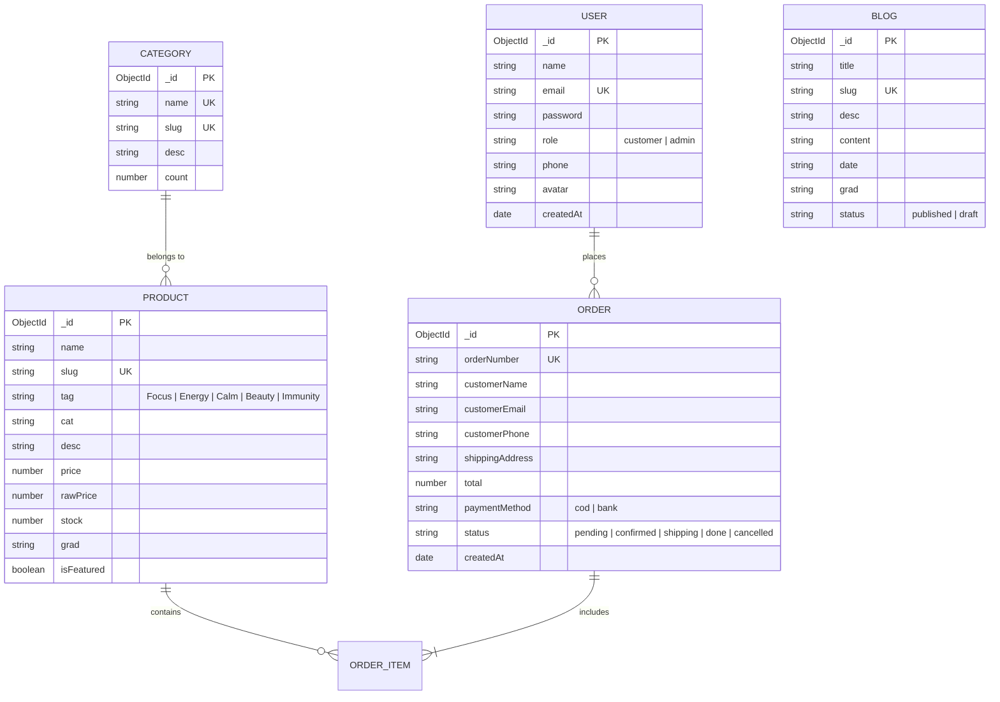

# 🏗 ARCHITECTURE.md — Kiến Trúc Hệ Thống & Specifications (Sprint 2)

Tài liệu này được soạn thảo bởi **Agent SA (`/sa-agent`)** chuyển giao từ `docs/REQUIREMENTS.md`.

---

## 📐 1. Diagram Kiến Trúc Cơ Sở Dữ Liệu (Mongoose ERD)



---

## 🛠 2. Chi Tiết File Structure & Model Specs

### 🔹 Helper Connection: `lib/mongodb.js`
- **Cấu trúc**: Singleton promise caching kết nối `mongoose.connect()`.
- **URI**: `process.env.MONGODB_URI || "mongodb://127.0.0.1:27017/green_atelier"`.

### 🔹 Models (`/models/`):
1. `models/User.js`: Schema với `mongoose.models.User || mongoose.model('User', UserSchema)`.
2. `models/Product.js`: Schema `ProductSchema` kèm index `{ slug: 1 }` và `{ tag: 1 }`.
3. `models/Category.js`: Schema `CategorySchema`.
4. `models/Order.js`: Schema `OrderSchema`.
5. `models/Blog.js`: Schema `BlogSchema`.

---

## ⚡ 3. API Route Specifications (`/api/seed`)

* **Endpoint**: `POST /api/seed` hoặc `GET /api/seed`
* **Mục đích**: Seed dữ liệu mẫu vào MongoDB.
* **Response Payload**:
```json
{
  "success": true,
  "message": "Seeded database successfully!",
  "counts": {
    "users": 1,
    "categories": 5,
    "products": 8,
    "blogs": 6
  }
}
```
