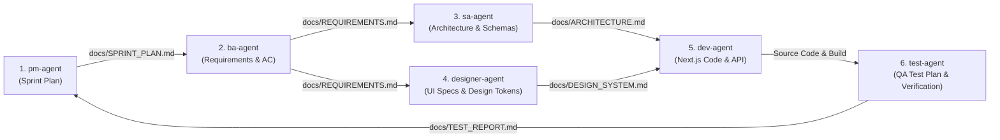

# 🔄 WORKFLOW.md — Quy Trình Tự Động Hóa 6-Agent Pipeline

Tài liệu này hướng dẫn sơ đồ vận hành, cơ chế bàn giao tài liệu (Artifact Handover) và cách kích hoạt hệ thống **6 Custom Agent** trong dự án Green Atelier.

---

## 📊 1. Sơ Đồ Pipeline & Truy Vết (Pipeline Diagram & Traceability)

Quy trình phát triển tuân theo luồng chuyển giao khép kín. Mỗi Agent sẽ tiếp nhận kết quả từ Agent trước đó trong thư mục `docs/`, xử lý công việc và ghi nhận sản phẩm đầu ra vào thư mục `docs/` để Agent sau truy vết.



---

## 📦 2. Bảng Bàn Giao Artifacts (Artifact Handover Matrix)

| Bước | Agent Phụ Trách | Artifact Đầu Vào (Input) | Artifact Đầu Ra (Output) | Mục Tiêu Bàn Giao |
| :--- | :--- | :--- | :--- | :--- |
| **1** | `pm-agent` | `docs/PROJECT_PLAN.md` | `docs/SPRINT_PLAN.md` | Xác định phạm vi Backlog item cần làm trong Sprint & phân công nhiệm vụ. |
| **2** | `ba-agent` | `docs/SPRINT_PLAN.md` | `docs/REQUIREMENTS.md` | Viết User Story chi tiết kèm Acceptance Criteria (AC) dạng Checklist. |
| **3** | `sa-agent` | `docs/REQUIREMENTS.md` | `docs/ARCHITECTURE.md` | Thiết kế DB Schemas, RESTful API Endpoints Spec & luồng dữ liệu Backend. |
| **4** | `designer-agent` | `docs/REQUIREMENTS.md` | `docs/DESIGN_SYSTEM.md` | Quy định màu sắc, typography, UI States (Empty, Loading, Error) & Accessibility. |
| **5** | `dev-agent` | `docs/ARCHITECTURE.md`<br/>`docs/DESIGN_SYSTEM.md` | Next.js Source Code (`app/`, `components/`, `models/`, `lib/`) | Triển khai mã nguồn Next.js API + Frontend, đảm bảo `npm run build` pass. |
| **6** | `test-agent` | `docs/REQUIREMENTS.md`<br/>Mã nguồn Dev | `docs/TEST_REPORT.md` | Thực thi Test Cases, đối soát Acceptance Criteria & phát hành QA Sign-off. |

---

## ⚡ 3. Cách Hướng Dẫn Vận Hành (Execution Guide)

### 🔴 Cách 1: Kích hoạt từng Agent thủ công (Slash Commands)

Bạn có thể chạy độc lập từng Agent theo thứ tự bằng cách sử dụng các slash command tương ứng:

1. **Lập kế hoạch Sprint**:
   ```text
   /pm-agent Hãy tạo sprint plan cho Phase 2: Kết nối Database MongoDB & Mongoose Schemas.
   ```
2. **Viết Requirements & AC**:
   ```text
   /ba-agent Hãy viết User Story và Acceptance Criteria chi tiết cho các task P2-1 đến P2-5 trong SPRINT_PLAN.md.
   ```
3. **Thiết kế Kiến trúc API & DB**:
   ```text
   /sa-agent Đọc REQUIREMENTS.md và thiết kế Mongoose Schemas kèm RESTful API Specifications.
   ```
4. **Thiết kế UI Specs**:
   ```text
   /designer-agent Cung cấp UI Specifications và Design Tokens cho các màn hình liên quan.
   ```
5. **Lập trình Dev**:
   ```text
   /dev-agent Hãy code các Mongoose Models trong models/ và helper connection trong lib/mongodb.js theo ARCHITECTURE.md.
   ```
6. **Kiểm thử QA**:
   ```text
   /test-agent Hãy lập test plan và kiểm thử toàn bộ code vừa tạo theo Acceptance Criteria trong REQUIREMENTS.md.
   ```

---

### 🟢 Cách 2: Tự động hóa trọn gói Toàn bộ Pipeline (Full Auto Pipeline)

Bạn có thể yêu cầu trợ lý Kiro tự điều phối chạy liên hoàn toàn bộ 6 Agent cho 1 Phase hoặc 1 tính năng cụ thể chỉ bằng 1 câu lệnh duy nhất:

> **Câu lệnh ví dụ**:
> *"Chạy pipeline tự động cho Phase 2: PM lập sprint plan, BA viết requirements cho P2-1 đến P2-7, SA thiết kế Schemas & API, Designer quy định UI, Dev tiến hành code & verify build, Test nghiệm thu theo Acceptance Criteria."*
